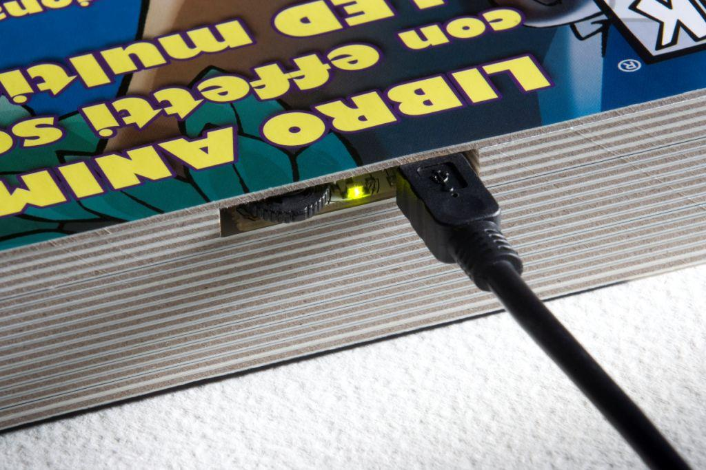
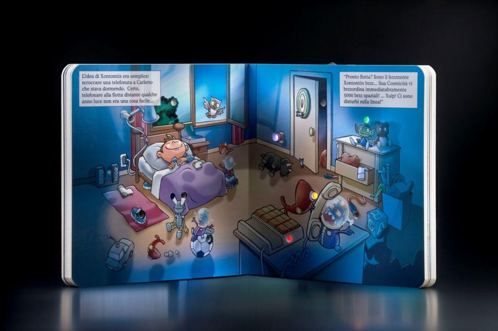

# BookLed
# **What is it?**
BookLed is a hardcover paper book designed for experimenting with **Python** and for exploring **Generative AI**.  

<!--  -->

In this github repository, examples of Python and Jupyter notebook codes are collected to explore the interfacing of a paper book with a PC and with generative AI.

See the [wiki](https://github.com/BookLed/wiki) for extensive documentation.

In appearance, BookLed is a normal book with thick card pages. 
At the top of the book, there is a small USB port and switch.

The technological core of the BookLed  is a **page identification sensor**: using a system of magnets, the book is able to recognize which page the user is reading and detect the turning from one page to the next.

So, connect BookLed to your PC and launch a **jupyter notebook**.   
The Python code inside jupyter can identify the book’s page and delivers the multimedia content synchronized with the turning of the pages:  

- soundtrack of the book and dubbing of the story with ‘cartoon’ voices.  
- animated backgrounds that virtually extend the printed page to the Web.  
- interaction with **AI generated Little Owl character**.  

### SYSTEM REQUIREMENTS
To experiment with the BookLed you need:
  * A BookLed
  * A USB cable
  * A PC
  * Python 3.11.0 or higher or jupyter notebook installed
  * An openAI API account to experiment with generative AI

# **Quick Start**

### 1. Install USB Silabs Drivers
### 2. Go to github to download jupyter notebooks
### 3. Explore Generative AI with the help of Little Owl!

## CODE EXAPLES

Below is the list of code examples for BookLed that you can download from this repository.

| jupyter notebook            | OpenAI API | Description |
| ----------------- | --------- | ----------- |
| BookLed Experiment 1 (Hello Owl!).ipynb            | [NOT REQUIRED]    | This is the "Hello world" code to play with BookLed |
| BookLed Experiment 2 (Talking Owl!).ipynb            | [NOT REQUIRED]    | The pages of the BookLed are recited with cartoon voices! |
| BookLed Experiment 3 (Behind the book).ipynb            | [NOT REQUIRED]    | The pages of the BookLed are augmented with interactive scenography! |
| BookLed Experiment 4 (AI tells the story).ipynb            | [REQUIRED]    | The pages of the book are narrated by the voice of the AI! |
| BookLed Experiment 4 (Litte Owl tells the story).ipynb            | [REQUIRED]    | The pages of the book are narrated by the voice of Little Owl! |

# **The story inside**
Little Owl finds himself up against a merry band of little men from outer space who are intent on invading the Earth. Little Owl saves the day (even though Daddy Owl has lovingly explained that flying saucers do not exist).
As the pages turn, Little Owl’s adventures are revealed, with lights and sounds adding to the fun.

# **The story outside**
The story of Bookled began in 2009 with a visionary idea: to blend the **magic of storytelling** with cutting-edge **electronic HW technology**. At that time, e-books were not widespread, and iPads did not yet exist. Bookled aimed to rekindle children's love for reading, offering a captivating alternative to video games.

Yet, the Bookled project faced a swift decline in 2010, as the unveiling of the **iPad** captivated the world's attention, eclipsing interest in "standard" electronic books.

Today, we proudly present you with a **mint condition** Bookled, perfect and pristine, with only the LiPo batteries replaced. We firmly believe that the concept of merging storytelling with electronic HW technology remains as powerful as ever. Now, we invite all enthusiasts of storytelling and technology to delve into this exciting concept. We're providing **open-source codes** to enable swift and seamless experimentation.  
Explore, innovate, and rediscover the joy of reading with Bookled.

