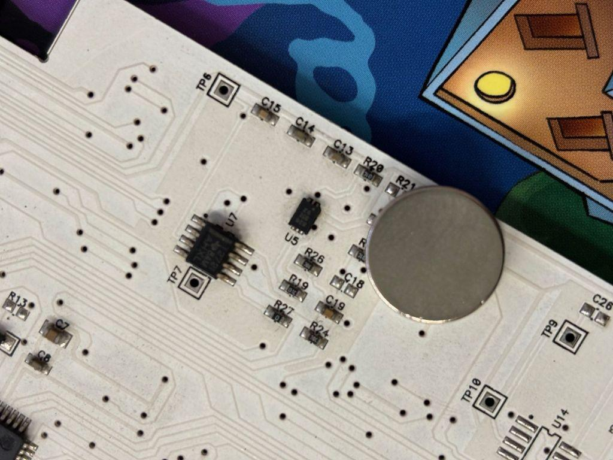

BookLed -- AI Storytelling Paper Book
====================================

## **DESCRIPTION**
BookLed is a hardcover paper book, containing electronic hardware, designed for experimenting with **Python** and for exploring **Generative AI**. 
With a BookLed and an OpenAI API account you can explore the world of AI storytelling **starting from the pages of a paper book**!

In this github repository, examples of Python and Jupyter notebook codes are collected to explore the interfacing this paper book with a PC and with generative AI.

See the [wiki](https://github.com/robotoons/BookLed/wiki) for extensive documentation.

To dowload the BookLed Technical Manual go to [BookLed Technical Manual](https://github.com/robotoons/BookLed/blob/main/docs/BookLed%20technical%20manual%20v1.0.pdf)

In appearance, BookLed is a normal book with thick card pages. 
At the top of the book, there is a small USB port and switch.

The technological core of the BookLed  is a **page identification sensor**: using a system of magnets, the book is able to recognize which page the user is reading and detect the turning from one page to the next.

So, connect the USB of the BookLed to your PC and launch the **jupyter notebooks** or the **python codes** provided in this repository.   
This codes can identify the book’s page and delivers the multimedia content synchronized with the turning of the pages:  

- soundtrack of the book and dubbing of the story with ‘cartoon’ voices.  
- animated backgrounds that virtually extend the printed page.  
- **expanded narrative contents** created by the power of **generative AI**.  

## **SYSTEM REQUIREMENTS**
To experiment with the BookLed you need:
  * A BookLed  ([buy it from Tindie](https://www.tindie.com/products/robotoons/bookled/))
  * A USB cable
  * A PC
  * Python 3.11.0 or higher or jupyter notebook installed
  * An openAI API account to experiment with generative AI

## **Quick Start**

### 1. Install USB Silabs Drivers
### 2. Go to experiment pages to download jupyter notebooks or python codes
### 3. Explore Generative AI with the help of Little Owl! (_OpenAI API account required_)

## **CODE EXAMPLES**

Below is the list of Jupyter notebook code examples for BookLed that you can download from this repository.

| Jupyter Notebook                                      | OpenAI API       | Description                                                                                  |
| ----------------------------------------------------- | ---------------- | -------------------------------------------------------------------------------------------- |
| [BookLed Experiment 1 (Hello Owl!).ipynb](https://github.com/robotoons/BookLed/blob/main/codes/jupyter%20notebooks/BookLed%20Experiment%201%20(Hello%20Owl!).ipynb)               | [NOT REQUIRED]   | This is the "Hello world" code to play with BookLed                                          |
| [BookLed Experiment 2 (Talking Book!) - ENGLISH.ipynb](https://github.com/robotoons/BookLed/blob/main/codes/jupyter%20notebooks/BookLed%20Experiment%202%20(Talking%20Book!)%20-%20ENGLISH.ipynb)  | [NOT REQUIRED]   | The pages of the BookLed are recited with **English cartoon voices**!                        |
| [BookLed Experiment 3 (AI Book) V3.ipynb](https://github.com/robotoons/BookLed/blob/main/codes/jupyter%20notebooks/BookLed%20Experiment%203%20(AI%20Book)%20V3.ipynb)               | [REQUIRED]       | Experience the magic of having the pages of your paper book brought to life through **generative AI storytelling**! |
| [BookLed Experiment 4 (AI Book) - ITALIAN V0.ipynb](https://github.com/robotoons/BookLed/blob/main/codes/jupyter%20notebooks/BookLed%20Experiment%204%20(AI%20book)%20-%20ITALIAN%20V0.ipynb)     | [REQUIRED]       | Add the magic of a **soundtrack** to your experience! Narrative voice in Italian.            |
| [BookLed Experiment 5 (AI book) - ENGLISH V5.ipynb](https://github.com/robotoons/BookLed/blob/main/codes/jupyter%20notebooks/BookLed%20Experiment%205%20(AI%20book)%20-%20ENGLISH%20V5.ipynb)     | [REQUIRED]       | Add the magic of a soundtrack and an English narrative voice!                                |

Below is the list of python codes for BookLed that you can download from this repository.

| python            | OpenAI API | Description |
| ----------------- | --------- | ----------- |
| [BookLed Experiment 1 (Hello Owl!).py](https://github.com/robotoons/BookLed/blob/main/codes/python/BookLed%20Experiment%201%20(Hello%20Owl!).py)            | [NOT REQUIRED]    | This is the "Hello world" code to play with BookLed |
| [BookLed Experiment 2 (Talking Book!) - ENGLISH.py](https://github.com/robotoons/BookLed/blob/main/codes/python/BookLed%20Experiment%202%20(Talking%20Book!)%20-%20ENGLISH.py)            | [NOT REQUIRED]    | The pages of the BookLed are recited with english **cartoon voices**! |

